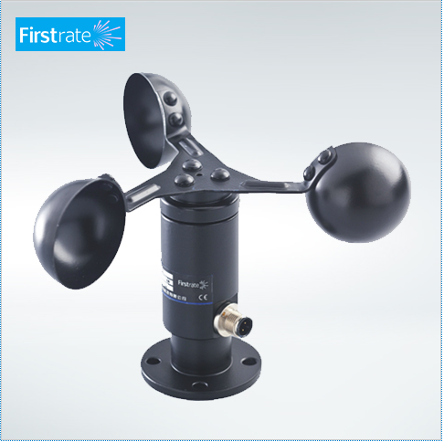
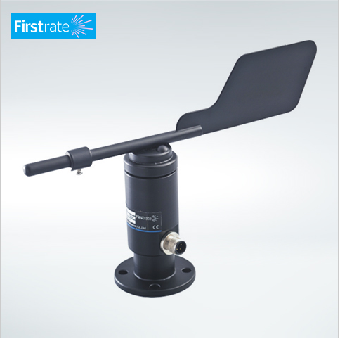
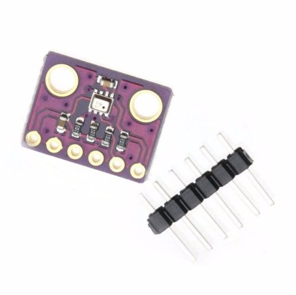

# VSCP weather station demo

*This is work in progress.*

This is demo code for a weather station. It uses the [Accra counter module](https://www.grodansparadis.com/accra/accra.html) and the [Vilnius A/D module](http://www.grodansparadis.com/vilnius/vilnius.html) from [Grodans Paradis AB](https://www.grodansparadis.com). 

This code is part of the [VSCP project](https://www.vscp.org).

## Sensors

### Wind speed, Wind direction, Rain detector
[Sparfun Weather Meters](https://www.sparkfun.com/products/8942)

----

### Wind Speed
One Pulse and one voltage unit from [Firstrate](http://www.firstsensor.com.cn/products_detail/productId=144.html)

Described [here](http://www.firstsensor.com.cn/products_detail/productId=144.html)

----

### Wind direction
One pulse unit from [Firstrate](http://www.firstsensor.com.cn/products_list/pmcId=24.html)

Described [here](http://www.firstsensor.com.cn/products_detail/productId=144.html)

----

### Temperature, Pressure, Humidity

BME280 Info [here](https://www.bosch-sensortec.com/bst/products/all_products/bme280)

----

License is [MIT](https://www.google.com/url?sa=t&rct=j&q=&esrc=s&source=web&cd=4&cad=rja&uact=8&ved=2ahUKEwiO2Mv4y_7cAhUFM5oKHSkxA90QFjADegQIBhAB&url=https%3A%2F%2Fopensource.org%2Flicenses%2FMIT&usg=AOvVaw1MsEPekvPKCIceu2jiRDy4)

Copyright 2018 [Ake Hedman, Grodans Paradis AB](akhe@grodansparadis.com)

